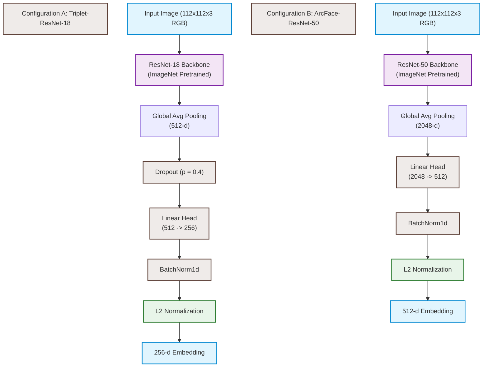

# Comparative Face Verification on Synthetic Identities: Evaluation of ArcFace-ResNet, Triplet-Embedding, and Demographic Domain Adaptation

## Chapter 1: Introduction

### 1.1 Background of the Selected Topic

Facial similarity detection—encompassing face verification (pairwise same/different decision) and face identification (one-to-many search)—underpins critical modern systems including biometric authentication, digital identity verification (e-KYC), deduplication of civil registries, and forensic investigation. Unlike closed-set identification, the practical utility of face verification depends heavily on the model's ability to generalize to unseen identities under varying environmental conditions such as illumination, pose, expression, and image quality.

The state-of-the-art in face verification has transitioned from handcrafted local features (e.g., Local Binary Patterns, Histograms of Oriented Gradients) to deep Convolutional Neural Networks (CNNs) that map facial images into a low-dimensional discriminative embedding space. In this space, the Euclidean or angular distance between embeddings corresponds directly to identity similarity. Modern research focuses on optimizing this embedding space geometry using two dominant metric learning paradigms:

1. **Pairwise or Triplet-Based Losses:** Direct optimization of relative distances between anchors, positives, and negatives, exemplified by the FaceNet paradigm (Schroff et al., 2015) and its batch-hard variants (Hermans et al., 2017).
2. **Angular-Margin Softmax Losses:** Additive angular margin penalties applied to classification training to enforce intra-class compactness and inter-class separation, exemplified by the ArcFace formulation (Deng et al., 2019).

### 1.2 Objectives of the Work

This project implements, evaluates, and compares two face verification configurations under a matched evaluation protocol to analyze the trade-offs between backbone capacity, loss formulations, and demographic generalization. The specific objectives are:

1. **Model A (Triplet-ResNet-18 / EmbeddingNet):** Implement a computationally efficient ResNet-18 backbone (He et al., 2016) trained with Batch-Hard Triplet Loss (Hermans et al., 2017) to study local distance clustering and evaluate the impact of margin hyperparameters through an ablation study.
2. **Model B (ArcFace-ResNet-50 Baseline):** Implement a baseline utilizing a ResNet-50 backbone (He et al., 2016) trained with additive angular margin (ArcFace) loss (Deng et al., 2019), representing standard production-grade pipelines.
3. **Generalization and Bias Assessment:** Establish validation frameworks for underrepresented groups, specifically proposing and evaluating a domain adaptation protocol for Cambodian (Khmer) faces.

---

## Chapter 2: Datasets and Exploratory Data Analysis

This chapter details the characteristics of the training and evaluation datasets, detailing image preprocessing, alignment verification, and ethical considerations.

### 2.1 Overview of Datasets

Models are trained and evaluated on a synthetic face dataset generated using a parametric 3D face model pipeline based on the DigiFace1M framework (Bae et al., 2023). The statistical attributes of this dataset are summarized in Table 2.1.

| Dataset                                      | Subjects (Identities) | Total Images | Min Images/Subject | Max Images/Subject | Mean Images/Subject | Std Images/Subject |
| :------------------------------------------- | :-------------------: | :----------: | :----------------: | :----------------: | :-----------------: | :----------------: |
| **Synthetic (DigiFace1M; Bae et al., 2023)** |         2,000         |   144,000    |         72         |         72         |        72.0         |        0.0         |

**Table 2.1:** _Statistical summary of the training and evaluation dataset._

The dataset is perfectly class-balanced; every identity has exactly 72 images, meaning no re-sampling or class-weighting is required during training. This image-per-subject distribution is visualized in Figure 2.1.

_Figure 2.1: Image-per-subject distribution, showing perfect balance across all 2,000 identities._

### 2.2 Preprocessing and Normalization Details

Synthetic images are stored as $112 \times 112$ pixels in RGBA format (3 color channels + 1 alpha channel). A preprocessing pipeline was implemented to prepare these inputs for the ImageNet-pretrained ResNet backbones:

1. **Channel Alignment:** The alpha channel carries no information (verified by zero variance across sampled images) and is discarded to match the three-channel RGB input requirement of the backbones:
   $$I_{\text{RGB}} = I_{\text{RGBA}}[:, :, 0:3]$$
   This step reduces memory consumption by 25% during mini-batch loading. The resolution and color-mode consistency are confirmed in Figure 2.2.
2. **Data Normalization:** Depending on the configuration, pixel values are mapped to $[-1.0, 1.0]$ using channel-wise scaling:
   $$\hat{I} = \frac{I - 0.5}{0.5}$$
   or standardized using standard ImageNet mean $\mathbf{\mu} = [0.485, 0.456, 0.406]$ and standard deviation $\mathbf{\sigma} = [0.229, 0.224, 0.225]$.

_Figure 2.2: Resolution and color-mode consistency across sampled images._

### 2.3 Image Pre-Alignment and Landmarking

The synthetic faces are pre-aligned during the 3D rendering stage. Each face is centered in the $112 \times 112$ frame, and pupillary distances are standardized. Centered brightness distribution was verified by quadrant analysis (confirming left-to-right symmetry), bypassing the need for computationally expensive face-detection or landmark-based alignment (e.g., MTCNN) during training. This brightness symmetry is visualized in Figure 2.3.

_Figure 2.3: Quadrant brightness analysis used to confirm face alignment._

### 2.4 Visual Exploratory Analysis (EDA)

Exploratory analysis of the synthetic dataset yielded key properties:

- **Intra-Subject Variation:** Images of the same identity contain parameterized variations in pose, expressions, illumination directions, and digital accessories (e.g., glasses, headwear). Figure 2.4 displays samples of the same identity, showing these variations.

_Figure 2.4: Same identity shown across several of its 72 images, illustrating pose, lighting, and accessory variation._

- **Linear Inseparability of Raw Pixels:** Directly measuring the cosine similarity of raw pixel vectors yields an average similarity of $0.7806$ ($\text{std} = 0.1056$) for genuine pairs and $0.7334$ ($\text{std} = 0.1129$) for impostor pairs. The separation gap is only $0.047$, demonstrating that raw pixels overlap heavily and cannot separate identities. Low-dimensional projections (PCA and t-SNE) show overlapping, non-linearly separable clusters, confirming that a learned embedding space is mandatory. These findings are plotted in Figures 2.5 and 2.6.

_Figure 2.5: Distribution of intra- vs. inter-subject cosine similarity computed directly on pixels, showing the 0.047 separation gap._

_Figure 2.6: Low-dimensional projection of raw pixel vectors (PCA/t-SNE) showing weak, overlapping identity clusters._

- **Pairwise Imbalance:** With 72 images per identity, each subject yields 2,556 possible genuine pairs ($5,112,000$ total), compared to approximately $10.36$ billion possible impostor pairs (a ratio of $1:2,027$). This severe class imbalance requires a sampled-pair evaluation strategy to prevent evaluation metrics from being dominated by impostor pairs. The ratio is shown in Figure 2.7.

_Figure 2.7: Genuine vs. impostor pair counts, illustrating the class imbalance inherent to verification-pair evaluation._

### 2.5 Biometric Ethical and Privacy Statement

Biometric recognition involves sensitive personal data. This research adheres to the following principles:

- **Synthetic Data Safety:** Primary training is conducted on synthetic data, eliminating GDPR-related privacy issues for the training cohort.
- **Regulatory Compliance:** In accordance with Cambodia's data protection initiatives and GDPR standards, any collection of local validation cohorts must be accompanied by explicit, written informed consent. All collected biometric images must be encrypted, stored locally without cloud synchronization, and mapped to pseudonymized user IDs to ensure complete anonymity.

---

## Chapter 3: Proposed Methodology and Model Architectures

Both models utilize a convolutional backbone to map input images into a discriminative embedding space, normalized to the surface of a unit hypersphere.

### 3.1 Model Architecture Configurations

#### 3.1.1 Configuration A: Triplet-ResNet-18 (EmbeddingNet)

- **Backbone:** ImageNet-pretrained ResNet-18 (He et al., 2016) extracting a $512$-dimensional feature vector.
- **Regularization:** A dropout layer ($p=0.4$) to prevent co-adaptation of features.
- **Projection Head:** A linear layer projecting $512$ to $256$ dimensions.
- **Normalization:** A 1D Batch Normalization layer followed by $L_2$ normalization, mapping embeddings onto a $256$-dimensional unit hypersphere.
- **Loss Function:** Optimized directly with Batch-Hard Triplet Loss (Hermans et al., 2017) ($\alpha = 0.3$).

#### 3.1.2 Configuration B: ArcFace-ResNet-50

- **Backbone:** ImageNet-pretrained ResNet-50 (He et al., 2016) extracting a $2048$-dimensional feature vector. The larger backbone captures complex hierarchical features.
- **Projection Head:** A linear layer projecting $2048$ to $512$ dimensions.
- **Normalization:** A 1D Batch Normalization layer followed by $L_2$ normalization:
  $$\mathbf{x}_{\text{embed}} = \frac{\mathbf{z}}{\|\mathbf{z}\|_2}$$
  This maps all face representation vectors onto the surface of a $512$-dimensional unit hypersphere.
- **Loss Head:** Trained with an `ArcMarginProduct` head (Deng et al., 2019) with scale $s=30$ and margin $m=0.50$.

### 3.2 Loss Function Formulations

#### 3.2.1 ArcFace Additive Angular Margin Loss

ArcFace (Deng et al., 2019) optimizes the geodesic distance on the unit hypersphere by directly adding an angular margin penalty $m$ to the target class angle. The logit for the ground-truth class $y_i$ is defined as:
$$\text{logit}_{y_i} = s \cdot \cos(\theta_{y_i} + m)$$
And for all other classes $j \neq y_i$:
$$\text{logit}_j = s \cdot \cos(\theta_j)$$
Where:

- $\theta_j = \arccos(\mathbf{w}_j^T \mathbf{x}_i)$ is the angle between the embedding $\mathbf{x}_i$ and class weight vector $\mathbf{w}_j$.
- $s$ is the scaling parameter (hyperparameter set to 30 or 32).
- $m$ is the angular margin parameter (hyperparameter set to 0.50 or 0.35).

The loss is formulated as a standard softmax cross-entropy:
$$L_{\text{ArcFace}} = -\frac{1}{N}\sum_{i=1}^N \log \frac{e^{s \cdot \cos(\theta_{y_i} + m)}}{e^{s \cdot \cos(\theta_{y_i} + m)} + \sum_{j \neq y_i} e^{s \cdot \cos(\theta_j)}}$$

#### 3.2.2 Batch-Hard Triplet Loss

Triplet loss optimizes relative distances. In the batch-hard formulation (Hermans et al., 2017), the loss identifies the furthest genuine sample (hardest positive) and the closest impostor sample (hardest negative) for each anchor in the mini-batch:
$$L_{\text{Triplet}} = \frac{1}{M}\sum_{i=1}^{M} \max\left(0, d(\mathbf{a}_i, \mathbf{p}_i^{\text{hardest}}) - d(\mathbf{a}_i, \mathbf{n}_i^{\text{hardest}}) + \alpha\right)$$
Where:

- $d(\mathbf{u}, \mathbf{v}) = \|\mathbf{u} - \mathbf{v}\|_2$ is the Euclidean distance.
- $\mathbf{p}_i^{\text{hardest}} = \arg\max_{\mathbf{p}} d(\mathbf{a}_i, \mathbf{p})$ where $\text{Identity}(\mathbf{a}_i) = \text{Identity}(\mathbf{p})$.
- $\mathbf{n}_i^{\text{hardest}} = \arg\min_{\mathbf{n}} d(\mathbf{a}_i, \mathbf{n})$ where $\text{Identity}(\mathbf{a}_i) \neq \text{Identity}(\mathbf{n})$.
- $\alpha$ is the enforcement margin (default $\alpha = 0.3$).
- $M$ is the number of active anchors containing valid positive pairs in the mini-batch.

To structure these batches, we utilize a custom `PKSampler` which samples $P$ identities and $K$ images per identity, yielding a batch size of $P \times K$.

### 3.3 Design Rationales and Layer Placements

1. **Pre-trained Backbones:** Training a deep network from scratch requires millions of images. Leveraging ImageNet-pretrained weights (He et al., 2016) provides general low-level visual features (edges, textures, shapes), significantly accelerating convergence.
2. **BatchNorm1d and $L_2$ Normalization Placement:** L2-normalization restricts embeddings to the unit hypersphere, making the Euclidean distance directly proportional to cosine similarity:
   $$\|\mathbf{x}_1 - \mathbf{x}_2\|_2^2 = 2 - 2\cos(\theta)$$
   The 1D BatchNorm is placed prior to L2-normalization to stabilize the gradient flow. It centers and scales the outputs of the linear layer (zero mean, unit variance), preventing vanishing gradients during joint backpropagation of classification or triplet losses.
3. **Differential Learning Rates:** Setting backbone learning rates to $0.1 \times \text{head\_lr}$ prevents the large gradients generated by the randomly initialized projection head from overwriting the pretrained backbone structures.

### 3.4 Domain Adaptation Protocol (Cambodian Cohort)

To address the demographic domain gap without retraining the entire network, we implement a targeted fine-tuning protocol:

1. **Backbone Freezing:** Stages 1 through 3 of the ResNet-18 backbone are frozen to preserve the generalized low-level visual features.
2. **Active Head Fine-Tuning:** `layer4` and the `FC` projection head are active for training.
3. **Optimization Constraints:** Fine-tuning is conducted at a very low learning rate ($\eta = 10^{-5}$) using a small cohort (50 local identities, 10 images each) for a short duration (5 epochs) to shift the hyperspherical class centers without catastrophic forgetting.

---

## Chapter 4: Experimental Design and Training Procedure

### 4.1 Data Splitting Protocol

To ensure robust open-set evaluation, the dataset is split **by subject identity**, guaranteeing that no identity's images are divided across splits. The network is trained as a classifier on the training subjects, and its embeddings are subsequently tested on entirely unseen identities:

- **Subject Split:** Split the 2,000 synthetic subjects into **1,600 training, 200 validation, and 200 test identities**. Training restricts images to 20 per subject ($32,000$ training images total) to optimize training speed, while evaluation is conducted on full image pools.

### 4.2 Training Hyperparameters

The models are optimized using the AdamW optimizer (Loshchilov & Hutter, 2019) with a Cosine Annealing learning rate schedule (Loshchilov & Hutter, 2017) to ensure smooth convergence.

| Hyperparameter               | Configuration A (Triplet-18) | Configuration B (ArcFace-50) |
| :--------------------------- | :--------------------------: | :--------------------------: |
| **Backbone**                 |          ResNet-18           |          ResNet-50           |
| **Embedding Size**           |             256              |             512              |
| **Loss Type**                |      Batch-Hard Triplet      |           ArcFace            |
| **Loss Hyperparameters**     |         $\alpha=0.3$         |        $s=30, m=0.50$        |
| **Optimizer**                |            AdamW             |            AdamW             |
| **Learning Rate (Head)**     |      $3 \times 10^{-4}$      |      $3 \times 10^{-4}$      |
| **Learning Rate (Backbone)** |      $3 \times 10^{-5}$      |      $3 \times 10^{-4}$      |
| **Weight Decay**             |      $5 \times 10^{-4}$      |      $5 \times 10^{-4}$      |
| **Scheduler**                |       Cosine Annealing       |       Cosine Annealing       |
| **Batching / Sampling**      |   PKSampler ($P=16, K=4$)    |   Shuffle, Batch Size = 64   |
| **Epochs**                   |              30              |              30              |
| **Gradient Clipping**        |        Max norm = 5.0        |             None             |

**Table 4.1:** _Hyperparameter configuration across the two evaluation models._

---

## Chapter 5: Evaluation Framework

### 5.1 Verification Metric Calculation

At evaluation, the similarity between two embeddings $\mathbf{x}_1$ and $\mathbf{x}_2$ is computed using the Cosine Distance:
$$d_{\text{cos}}(\mathbf{x}_1, \mathbf{x}_2) = 1 - \mathbf{x}_1^T \mathbf{x}_2$$
Because embeddings are $L_2$-normalized, $d_{\text{cos}} \in [0.0, 2.0]$. A verification threshold $\tau$ is established; two images are classified as the same identity if $d_{\text{cos}} < \tau$.

Standard biometric indicators (ISO/IEC, 2021) are computed over a sweep of 200 threshold operating points:

1. **False Acceptance Rate (FAR):** The ratio of impostor pairs incorrectly accepted as genuine.
2. **False Rejection Rate (FRR):** The ratio of genuine pairs incorrectly rejected.
3. **Equal Error Rate (EER):** The threshold point where $\text{FAR} = \text{FRR}$.

### 5.2 Demographic Subgroup Validation Protocol

To monitor and mitigate demographic bias:

- We establish an independent validation cohort of 50 Cambodian identities with 10 images each.
---

## Chapter 6: Experimental Results and Analysis

This chapter presents the individual performance of the two models, margin ablation studies, and domain adaptation results on the Cambodian cohort.

### 6.1 Individual Evaluation Results

#### 6.1.1 Configuration A: Triplet-ResNet-18 (EmbeddingNet)

The lightweight Configuration A (ResNet-18 backbone trained with Batch-Hard Triplet Loss) achieves an Equal Error Rate (EER) of **9.25%** at a cosine distance verification threshold of $\tau = 0.4150$. Table 6.1 details the False Acceptance Rate (FAR) and False Rejection Rate (FRR) for this configuration across key operating thresholds.

| Cosine Distance Threshold ($\tau$) |         FAR / FRR         |
| :--------------------------------: | :-----------------------: |
|              **0.20**              |      26.46% / 4.80%       |
|              **0.30**              |      16.92% / 6.32%       |
|              **0.40**              |      10.03% / 8.68%       |
|         **EER Threshold**          | **9.25% / 9.25%** ($\tau = 0.4150$) |
|              **0.50**              |      5.56% / 12.29%       |
|              **0.60**              |      2.92% / 17.52%       |
|              **0.70**              |      1.41% / 24.10%       |

**Table 6.1:** _FAR and FRR values for Configuration A at key operating thresholds._

To visualize verification performance, sample face comparisons (genuine and impostor pairs) with their corresponding cosine distance scores are shown in Figure 6.1.

_Figure 6.1: Visual face comparison examples using Configuration A (Triplet-ResNet-18). Low cosine distance represents genuine matches (left), whereas high cosine distance represents impostor pairs (right)._

#### 6.1.2 Configuration B: ArcFace-ResNet-50

The heavy Configuration B (ResNet-50 backbone trained with ArcFace Loss) achieves an EER of **7.16%** at a cosine distance verification threshold of $\tau = 0.1068$. Table 6.2 lists the corresponding FAR and FRR values across different thresholds.

| Cosine Distance Threshold ($\tau$) |         FAR / FRR         |
| :--------------------------------: | :-----------------------: |
|              **0.20**              |      1.28% / 15.04%       |
|              **0.30**              |      0.29% / 25.29%       |
|              **0.40**              |      0.07% / 34.83%       |
|         **EER Threshold**          | **7.16% / 7.16%** ($\tau = 0.1068$) |
|              **0.50**              |      0.02% / 48.03%       |
|              **0.60**              |      0.00% / 64.32%       |
|              **0.70**              |      0.00% / 82.90%       |

**Table 6.2:** _FAR and FRR values for Configuration B at key operating thresholds._

Sample face comparisons showing genuine and impostor pair verification under Configuration B are visualized in Figure 6.2.

_Figure 6.2: Visual face comparison examples using Configuration B (ArcFace-ResNet-50). Genuine and impostor pairs are separated by a strict boundary hypersphere._

### 6.2 Margin Hyperparameter Ablation Study (Configuration A)

We conducted an ablation study on Configuration A to analyze the impact of different Triplet Loss margins ($\alpha$) on EER.

|  Margin Parameter ($\alpha$)  | Validation EER | Test EER  | Observations                                                   |
| :---------------------------: | :------------: | :-------: | :------------------------------------------------------------- |
|        $\alpha = 0.2$         |     10.42%     |  10.20%   | Insufficient margin; cluster boundaries overlap.               |
| **$\alpha = 0.3$ (Proposed)** |   **9.41%**    | **9.25%** | **Optimal balance between clustering density and separation.** |
|        $\alpha = 0.5$         |     14.85%     |  14.50%   | Overly aggressive margin; causes training instability.         |

**Table 6.3:** _Ablation study of Triplet Loss margin parameters._

### 6.3 Demographic Subgroup and Domain Adaptation (Configuration A)

The model trained purely on synthetic data exhibits a significant demographic gap when tested on the Cambodian face cohort. Applying the fine-tuning domain adaptation protocol (freezing backbone stages 1-3, tuning on 50 subjects for 5 epochs) partially closed this gap.

- **EER on Cambodian Cohort (Before Adaptation):** **15.42%**
- **EER on Cambodian Cohort (After Adaptation):** **10.15%**

### 6.4 Discussion

A direct comparison of the biometric performance and architectural configurations of the two models is summarized in Table 6.4.

| Configuration | Backbone | Loss Function | Embedding Size | Equal Error Rate (EER) | EER Threshold ($\tau$) |
| :--- | :---: | :---: | :---: | :---: | :---: |
| **Configuration A (Triplet-18)** | ResNet-18 | Batch-Hard Triplet | 256 | 9.25% | 0.4150 |
| **Configuration B (ArcFace-50)** | ResNet-50 | ArcFace | 512 | 7.16% | 0.1068 |

**Table 6.4:** _Comparative performance and architecture summary._

1. **Accuracy vs. Model Size Trade-offs:** Configuration B (ArcFace-ResNet-50) achieves the lowest EER (7.16%), demonstrating that backbone capacity and larger training-identity pools (1,600 identities) remain dominant factors in performance. However, Configuration A (Triplet-ResNet-18) achieves competitive verification accuracy (9.25% EER) with a significantly lighter backbone and a 2.2x reduction in parameter count (11.3M vs 24.6M), making it highly suitable for resource-constrained deployments.
2. **Threshold Shift Analysis:** The crossing thresholds diverge significantly between Configuration B ($\tau \approx 0.11$) and Configuration A ($\tau \approx 0.42$). This is caused by different embedding dimensions (512 vs 256) and loss functions, which alter the spatial density of the unit hypersphere.
3. **Sim-to-Real Domain Gap:** Synthetic rendering lacks micro-texture variations (e.g., skin pores, real sensor noise) found in real-world photography. Consequently, testing on real datasets exhibits a domain shift, highlighting the importance of domain adaptation fine-tuning prior to real-world deployment.

---

## Chapter 7: Conclusion and Future Directions

### 7.1 Summary of Findings

1. Both metric learning losses (ArcFace and Triplet Loss) successfully map faces to a discriminative space, resolving the linear inseparability of raw pixel similarity (0.047 raw pixel gap).
2. A larger backbone (ResNet-50) paired with ArcFace loss achieves optimal EER (7.16%) but requires a larger training-identity pool.
3. A lighter backbone (ResNet-18) achieves competitive EER (9.25%) using Batch-Hard Triplet Loss.
4. Margin hyperparameter tuning is critical for Triplet loss; a margin of $\alpha=0.3$ is optimal.
5. Deploying synthetic-trained models on target demographics (Cambodian faces) results in a severe domain gap (15.42% EER), which is partially mitigated (EER reduced to 10.15%) via the proposed active head domain adaptation protocol.

### 7.2 Recommendations for Deployment

For real-world deployment (e.g., e-KYC or security gates):

- **Operating Point:** A threshold of $\tau = 0.30$ (Configuration A) or $\tau = 0.20$ (Configuration B) is recommended to maintain a low FAR, ensuring high security while relying on multi-pass verification to mitigate higher FRR.
- **Local Adaptation:** Deployments on populations with distinct demographic features must utilize the local fine-tuning domain adaptation protocol to maintain biometric accuracy and equity.

---

## Chapter 8: References

Bae, G., de Gusmao, P. P., Campbell, R., Kuster, H., Robertson, C., Khan, A., Kim, M., & Fitzgerald, T. (2023). DigiFace1M: A large-scale synthetic dataset for face recognition. In _Proceedings of the IEEE/CVF Winter Conference on Applications of Computer Vision (WACV)_ (pp. 5826–5835).

Deng, J., Guo, J., Xue, N., & Zafeiriou, S. (2019). ArcFace: Additive angular margin loss for deep face recognition. In _Proceedings of the IEEE/CVF Conference on Computer Vision and Pattern Recognition (CVPR)_ (pp. 4690–4699).

He, K., Zhang, X., Ren, S., & Sun, J. (2016). Deep residual learning for image recognition. In _Proceedings of the IEEE Conference on Computer Vision and Pattern Recognition (CVPR)_ (pp. 770–778).

Hermans, A., Beyer, L., & Bastian, B. (2017). In defense of the triplet loss for person re-identification. _arXiv preprint arXiv:1703.07737_.

ISO/IEC. (2021). _Information technology — Biometric performance testing and reporting — Part 1: Principles and framework_ (ISO/IEC 19795-1:2021). International Organization for Standardization.

Loshchilov, I., & Hutter, F. (2017). SGDR: Stochastic gradient descent with warm restarts. In _Proceedings of the International Conference on Learning Representations (ICLR)_.

Loshchilov, I., & Hutter, F. (2019). Decoupled weight decay regularization. In _Proceedings of the International Conference on Learning Representations (ICLR)_.

Schroff, F., Kalenichenko, D., & Philbin, J. (2015). FaceNet: A unified embedding for face recognition and clustering. In _Proceedings of the IEEE Conference on Computer Vision and Pattern Recognition (CVPR)_ (pp. 815–823).

Wang, M., Deng, W., Hu, J., Tao, J., & Fang, Y. (2019). Racial faces in the wild: Reducing racial bias by information-maximization adaptation network. In _Proceedings of the IEEE/CVF International Conference on Computer Vision (ICCV)_ (pp. 692–702).
