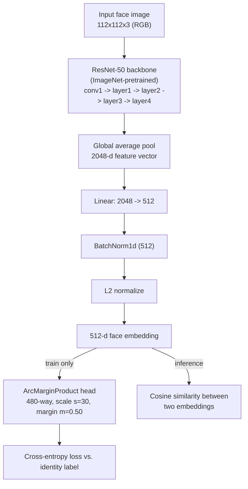
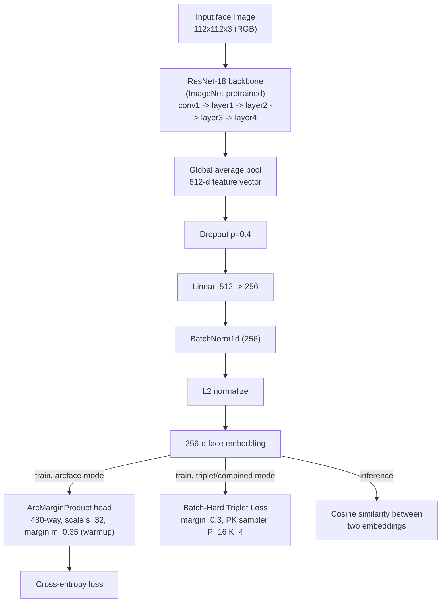

# Comparative Face Verification on Synthetic Identities: ArcFace-ResNet vs. a Custom Architecture

## 1. Introduction

### 1.1 Background

Face verification — deciding whether two face images belong to the same person — underpins a wide range of systems already in daily use: unlocking a phone, matching a passport photo at a border gate, confirming identity during a remote bank onboarding (e-KYC), and de-duplicating records in a large database of people. Unlike face _identification_, which searches a whole gallery for the closest match, verification is a pairwise same/different decision, and its practical value depends entirely on how reliably that decision holds up on identities the system has never encountered before.

This reliability requirement is why the problem still needs active research rather than a one-time engineering solution. A verification model must generalize to people outside its training set, remain stable across lighting, pose, expression, and image quality, and expose a decision threshold that a deployer can tune to their own tolerance for two very different failure modes: wrongly admitting an impostor (a security failure) and wrongly rejecting a genuine user (a convenience failure). Getting this balance wrong has real consequences — from a locked-out user to a breached account — which is why face verification is judged on threshold-dependent security metrics rather than a single accuracy number.

The current state of the art formulates this as a metric-learning problem: a convolutional neural network (commonly a ResNet-family backbone) is trained to map a face image to a compact vector, or _embedding_, such that images of the same identity land close together and images of different identities land far apart. Two loss families dominate the recent literature. The first is angular-margin softmax, exemplified by ArcFace [1] and its relatives CosFace and SphereFace, which turn ordinary classification training into a tool for shaping the embedding space by adding a margin penalty to the angle between an embedding and its true identity's class weight. The second is pairwise or triplet metric learning, exemplified by FaceNet [2], which directly optimizes the distance between explicitly chosen pairs or triplets of images. This project builds one model from each family — an ArcFace-style model built around a standard ResNet backbone, and a custom architecture that can switch between triplet loss, ArcFace loss, or a combination of both — and compares them directly under a shared evaluation protocol.

A second motivation specific to this project is data availability. Large real-world face datasets (e.g., CASIA-WebFace) raise consent and privacy questions, since the people in them did not necessarily agree to have their likeness used for biometric model training. This project trains primarily on a synthetic dataset of GAN/diffusion-generated identities that do not correspond to real people, side-stepping that concern while still producing a dataset large and varied enough to study face verification behavior.

### 1.2 Objectives

1. Build an **ArcFace-ResNet** baseline that follows the conventional recipe used in production-grade face recognition systems: an ImageNet-pretrained ResNet backbone trained with additive angular margin loss.
2. Build a **custom architecture** that keeps the same backbone-plus-embedding-head design but adds practical extensions — a configurable loss (triplet, ArcFace, or a weighted combination of both), margin warmup, differential learning rates for the pretrained backbone versus the new head, and heavier data augmentation targeted at the specific weaknesses this dataset's exploratory analysis exposed.
3. Train both models under a matched, subject-disjoint train/validation/test protocol so that reported performance reflects generalization to identities never seen during training, not memorization.
4. Evaluate both models on a shared set of biometric metrics and report where the two approaches agree, where they diverge, and why.

### 1.3 Dataset

Both models are trained on a synthetic face dataset of **2,000 identities, each with exactly 72 images**, for **144,000 images total** at a fixed resolution of **112×112 pixels**, stored as RGBA PNGs (mean file size ≈ 20.3 KB). The dataset's structure and quality were characterized in `eda.ipynb`, and several of its findings directly motivated design decisions described in Chapter 3.

**The dataset is perfectly class-balanced** — every identity has exactly 72 images, so no re-sampling or class-weighting is required before training.

_Figure 1.1 — Image-per-subject distribution, showing perfect balance across all 2,000 identities._

**Faces are pre-aligned and quality-consistent.** All images share the same 112×112 resolution and RGBA mode, and a per-quadrant brightness check shows centered, symmetric brightness typical of an already-aligned face crop — meaning no separate face-detection/alignment step is needed before training.

_Figure 1.2 — Resolution and color-mode consistency across sampled images._

_Figure 1.3 — Quadrant brightness analysis used to confirm face alignment._

**The alpha channel carries no information.** A sample of 50 images showed 0 with non-trivial alpha values, so every image is converted from RGBA to RGB before being fed to either model, which also reduces memory use by roughly 25%.

**Each identity shows real intra-class variation** in pose, lighting, accessories, and expression — the property that makes this a meaningful similarity-learning problem rather than a near-duplicate detection task.

_Figure 1.4 — Intra-subject variation gallery._

**Raw pixels cannot separate identities.** This is the single most important finding from the exploratory analysis, and the central justification for the entire project. Measuring cosine similarity directly on raw pixel vectors, images of the _same_ identity average a similarity of **0.7806** (std 0.1056), while images of _different_ identities average **0.7334** (std 0.1129) — a gap of only **0.047**. In other words, two different people's raw photos look almost as similar, numerically, as two photos of the same person. A learned embedding is not an optional refinement here; it is required for the task to work at all.

_Figure 1.5 — Distribution of intra- vs. inter-subject cosine similarity computed directly on pixels, showing the 0.047 separation gap that motivates learned embeddings._

_Figure 1.6 — Low-dimensional projection of raw pixel vectors (PCA explains 76.2% of variance in 10 components, 93.1% in 50), showing that identity structure exists but is not linearly separable from pixels alone._

**Genuine (same-identity) pairs are vastly outnumbered by impostor (different-identity) pairs.** With 72 images per identity, each subject yields 2,556 possible genuine pairs, for 5,112,000 genuine pairs across the dataset — against roughly 10.36 billion possible impostor pairs, a ratio of about **1:2,027**. Exhaustively evaluating on this imbalance is both computationally wasteful and statistically uninteresting past a certain sample size, which is why both models evaluate on a _sampled_ pool of pairs rather than every possible pair (Chapter 4).

_Figure 1.7 — Genuine vs. impostor pair counts, illustrating the class imbalance inherent to verification-pair evaluation._

**Other quality notes**: normalization statistics computed directly on this dataset (mean `[0.394, 0.320, 0.280]`, std `[0.223, 0.214, 0.216]`) differ noticeably from standard ImageNet statistics (mean `[0.485, 0.456, 0.406]`, std `[0.229, 0.224, 0.225]`), which matters for the normalization choice discussed in Chapter 3; blur scores span a wide range (median 170, min 10, max 1717), indicating some images are noticeably softer than others; and no obvious GAN checkerboard artifacts were found in frequency-domain spot checks, suggesting the generation process used is reasonably clean.

---

## 3. Proposed Methods

Both models share the same overall design pattern common to modern face verification systems: an ImageNet-pretrained convolutional backbone extracts a feature vector from a face image, a small head projects that feature vector down to a lower-dimensional embedding, and the embedding is L2-normalized so that comparing two faces reduces to a single cosine-similarity computation. They differ in backbone depth, embedding dimensionality, loss function, and training configuration — differences chosen deliberately so that comparing the two produces an informative result rather than two near-identical runs.

### 3.1 Method A — ArcFace-ResNet

**Architecture.**

_Figure 3.1 — ArcFace-ResNet architecture (`notebooks/ResNet.ipynb`, class `ResNetFaceEmbedding` + `ArcMarginProduct`)._

**Layer-by-layer justification:**

- **ResNet-50 backbone, ImageNet-pretrained (24.6M parameters total for this configuration).** Starting from ImageNet weights rather than random initialization gives the network working edge, texture, and shape detectors before it ever sees a face, which is essential given that training uses at most 32,000 images (1,600 identities × 20 images) — far too few to learn low-level visual features from scratch. ResNet-50 was chosen over the lighter ResNet-18 for this method specifically to test the ceiling of a heavier backbone under the same training budget, since deeper backbones have historically produced the best-published face-recognition results (e.g., IResNet-100 in the original ArcFace paper).
- **Global average pooling → 2048-d feature.** Standard ResNet-50 output; average pooling keeps the representation independent of any single spatial location, which is appropriate here because the dataset is already aligned, so the network does not need to learn to localize the face within the frame.
- **Linear 2048 → 512.** This projection is the only new, randomly initialized weight matrix besides the loss head, and it exists to compress the very high-dimensional backbone feature into a fixed-size embedding of a dimensionality (512) that matches common face-recognition conventions (e.g., the original ArcFace paper also uses 512-d embeddings).
- **BatchNorm1d(512).** Stabilizes the scale of the embedding coordinates before normalization, which in turn stabilizes ArcFace's angular-margin computation (small changes in raw feature scale would otherwise shift where the margin actually bites).
- **L2 normalization.** Forces every embedding onto the surface of a unit hypersphere. This is not a cosmetic choice: ArcFace's margin term is defined in terms of the _angle_ between an embedding and a class weight vector, and that angle is only meaningful once magnitude has been removed from the comparison. It is also what makes cosine similarity the natural, distance-consistent metric used later at inference.
- **ArcMarginProduct head (train-time only).** Rather than a plain linear classifier, this head computes the cosine similarity between the embedding and every identity's weight vector, adds a fixed angular margin (`m = 0.50`) to the true identity's angle, and scales the result (`s = 30`) before applying softmax cross-entropy. The margin is what forces genuinely _tight_ clustering of same-identity embeddings and _wide_ separation between different identities — a property a plain softmax classifier does not need in order to classify correctly, but which cosine-similarity verification depends on completely. The scale factor exists because cosine values are confined to [-1, 1], too narrow a range on their own to produce a useful cross-entropy gradient. This head is discarded after training; only the backbone and embedding layer are used at inference.

**Configuration:** image size 112×112; embedding dimension 512; ArcFace scale 30, margin 0.50; AdamW optimizer, learning rate 3×10⁻⁴, weight decay 5×10⁻⁴; cosine-annealing learning-rate schedule; batch size 64; 30 epochs; up to 20 of the 72 available images per training subject (a speed/coverage trade-off); standard ImageNet normalization statistics, since the backbone starts from ImageNet weights and the input distribution needs to match what those weights were originally trained on.

### 3.2 Method B — Custom Architecture

**Architecture.**

_Figure 3.2 — Custom architecture (`face_similarity.py`, class `EmbeddingNet` + `ArcMarginProduct` + `BatchHardTripletLoss`)._

**Layer-by-layer justification:**

- **ResNet-18 backbone, ImageNet-pretrained (11.3M parameters total: 11,176,512 in the backbone, 131,840 in the head).** A shallower backbone than Method A, chosen deliberately to test whether the extensions below (loss flexibility, augmentation, learning-rate scheduling) can close the gap against a heavier network, and to give a faster, cheaper model that is more practical to iterate on and eventually deploy.
- **Global average pooling → 512-d feature**, **Dropout(p=0.4)**. The dropout layer is the one addition not present in Method A: applied to the pooled feature before projection, it regularizes the embedding head against overfitting to the specific 480 training identities available (fewer than Method A's 1,600, see Chapter 4), which is a real risk given how much smaller this training pool is.
- **Linear 512 → 256, BatchNorm1d(256), L2 normalize.** A smaller embedding (256-d vs. 512-d) than Method A, trading some representational capacity for a lighter downstream comparison cost; the normalization and batch-norm serve the same purpose described for Method A.
- **ArcMarginProduct head with margin warmup.** The margin (`m = 0.35`, lower than Method A's 0.50, and scale `s = 32`) is ramped linearly from 0 up to its target value over the first `min(5, epochs // 3)` epochs rather than applied at full strength from step one. Early in training, embeddings are still close to their ImageNet-pretrained starting point and not yet separated by identity; applying the full margin immediately produces a loss landscape that punishes even mildly-correct predictions and can stall learning (this cold-start effect is visible in Method A's own epoch-1–2 accuracy, see Chapter 4). Warmup avoids that stall by giving the network a few epochs to find rough identity clusters before the margin starts enforcing tight separation.
- **Batch-Hard Triplet Loss (alternative/companion loss).** The architecture also supports training with triplet loss instead of, or combined with, ArcFace. For every anchor image in a batch, the hardest positive (furthest same-identity image) and hardest negative (closest different-identity image) are mined dynamically, and the loss pushes the anchor-positive distance below the anchor-negative distance by a margin of 0.3. This requires a **PK sampler** (P=16 identities × K=4 images per batch) so that every batch actually contains same-identity pairs to mine from. This option exists because triplet loss optimizes relative distances directly and can refine fine-grained, hard-case boundaries that a purely classification-style loss does not directly target — at the cost of being sensitive to which pairs get mined, which the EDA's 1:2,027 pair imbalance makes non-trivial (Chapter 1).
- **Differential learning rates.** The backbone is trained at one-tenth of the head's learning rate (`backbone_lr = lr × 0.1`), so that the ImageNet-pretrained convolutional weights are fine-tuned gently rather than overwritten by the large gradients a freshly-initialized head produces early in training — a standard transfer-learning safeguard not present in Method A.
- **Heavier, targeted data augmentation.** Compared to Method A's mild flip + brightness/contrast jitter, this pipeline applies broader color jitter (brightness, contrast, saturation, hue), random Gaussian blur, and random erasing. These were chosen directly in response to the EDA: color jitter targets the lighting/skin-tone variation the model will need to be robust to given the dataset's synthetic and demographically limited generation process; blur augmentation reflects the wide blur-score range observed in the data (10–1717); and random erasing simulates occlusions (glasses, masks, hands) that the model should not be thrown off by. `[0.5, 0.5, 0.5]` normalization is used instead of ImageNet statistics, since this pipeline is designed to allow training the backbone more aggressively than a lightly-fine-tuned one.

**Configuration:** image size 112×112; embedding dimension 256; default loss mode is ArcFace (scale 32, margin 0.35 with warmup), with triplet and combined (ArcFace + 0.5×triplet) modes available as alternatives; AdamW optimizer, head learning rate 3×10⁻⁴, backbone learning rate 3×10⁻⁵; weight decay 5×10⁻⁴; cosine-annealing schedule; gradient clipping at max-norm 5.0 (added specifically because batch-hard triplet mining can occasionally produce large gradient spikes on very hard pairs); batch size 128 (ArcFace mode) or P×K = 64 (triplet/combined mode); 30 epochs.

### 3.3 Shared Design Choices

Both methods use the same preprocessing convention (RGBA → RGB, resize to 112×112), the same subject-disjoint train/validation/test split logic to prevent identity leakage between splits, and the same inference-time decision rule: L2-normalized embeddings are compared with cosine similarity, and a calibrated threshold decides "same person" vs. "different person." This shared foundation is what makes a direct, controlled comparison between the two methods meaningful in Chapter 4, rather than a comparison confounded by unrelated pipeline differences.

---

## 4. Experiments and Results

### A. Experimental Setup

**Data splitting.** Both experiments split the dataset **by subject identity, never by image**, so that no identity's images are divided across splits — a subject is either entirely in training, entirely in validation, or entirely in test. This is the standard "closed-set training, open-set verification" protocol used in face-recognition research: the model is trained as an identity classifier over the training subjects only, and its embeddings are then tested for generalization on subjects it has never seen at all.

- **ArcFace-ResNet** (`notebooks/ResNet.ipynb`) draws its split directly from the full 2,000-subject synthetic pool with an 80/10/10 ratio: **1,600 training / 200 validation / 200 test identities**. Training uses a capped 20 of the available 72 images per subject (32,000 training images total) to keep epoch time manageable; validation and test subjects are used at full image count when building verification pairs.
- **Custom Architecture** (`face_similarity.py`) consumes a manifest produced by `scripts/prepare_splits.py`, which pools available dataset sources (only the synthetic source was available for this run — CASIA-WebFace requires a separate extraction step not yet performed), filters out any subject with fewer than 5 images, optionally samples down to a maximum subject pool (600 here), and then performs the same subject-level 80/10/10 split with a fixed seed (42) for reproducibility. This produced **480 training / 60 validation / 60 test identities**, using all 72 images per subject (34,560 / 4,320 / 4,320 images respectively), as recorded in `dataset/splits/split_config.json`.

The two experiments therefore use different-sized training pools (1,600 vs. 480 identities) — a real difference in experimental setup, not an oversight, and one the discussion below returns to when interpreting results.

**Role of the validation split.** In both pipelines, the validation split is reserved for identities the model never trains on and is used to build verification pairs and diagnostic metrics after each run. Neither pipeline currently uses validation loss for early stopping or learning-rate control; checkpoint selection in both cases uses a _training-set_ proxy (best training accuracy for ArcFace/combined modes, lowest training loss for triplet mode). This is a real limitation of the current setup, discussed further in Chapter 5.

**Training procedure and epochs.** Both models were trained for **30 epochs** using AdamW with a cosine-annealing learning-rate schedule, on Apple Silicon GPU (`mps`) hardware. ArcFace-ResNet used a batch size of 64 and reached 100% training-set identity accuracy by epoch 26, with the best checkpoint saved at epoch 27 (selected on training accuracy). The Custom Architecture, run in its default ArcFace mode, saved its best checkpoint at epoch 29.

|                                 | ArcFace-ResNet                  | Custom Architecture             |
| ------------------------------- | ------------------------------- | ------------------------------- |
| Backbone                        | ResNet-50 (ImageNet-pretrained) | ResNet-18 (ImageNet-pretrained) |
| Embedding dimension             | 512                             | 256                             |
| Total parameters                | 24,558,144                      | 11,308,352                      |
| Training identities             | 1,600                           | 480                             |
| Images/subject used in training | 20 of 72                        | 72 of 72                        |
| Loss                            | ArcFace (s=30, m=0.50)          | ArcFace (s=32, m=0.35, warmup)  |
| Batch size                      | 64                              | 128                             |
| Epochs                          | 30                              | 30                              |
| Best checkpoint                 | Epoch 27 (100% train acc)       | Epoch 29                        |

### B. Evaluation Protocols

Both models are evaluated with the same underlying idea — extract embeddings for held-out identities, form same-identity ("genuine") and different-identity ("impostor") pairs, and score every pair with cosine similarity — but report two complementary families of metrics, both standard in the face-verification literature:

1. **ROC-AUC, best-threshold accuracy, and TAR@FAR.** Genuine and impostor pairs are sampled (3,000 of each) from held-out identities, cosine similarities are computed, and a ROC curve is built by sweeping the decision threshold. ROC-AUC summarizes ranking quality independent of any single threshold choice. **TAR@FAR** (True Accept Rate at a fixed False Accept Rate) reports, e.g., "what fraction of genuine pairs is accepted if the system is configured to wrongly accept at most 1 in 100 (or 1 in 1,000) impostor pairs" — this is the standard metric quoted in benchmark face-verification protocols such as LFW and AgeDB, because it reports performance at the strict operating point a real deployment would actually use, rather than at an arbitrary "best" threshold.
2. **FAR, FRR, and EER over a dense threshold sweep.** Using up to 500,000 sampled pairs (subsampled from the full pair pool given the roughly 2,000:1 impostor:genuine imbalance identified in the EDA) and a grid of 201 threshold values, **FAR** (False Acceptance Rate) measures the fraction of impostor pairs wrongly accepted at a given threshold — the security-relevant error — while **FRR** (False Rejection Rate) measures the fraction of genuine pairs wrongly rejected — the convenience-relevant error. The **Equal Error Rate (EER)** is the point where these two curves cross, giving a single number that summarizes the unavoidable trade-off between the two error types without presupposing which one a deployer cares about more.

These two protocols are complementary rather than redundant: ROC-AUC/TAR@FAR emphasize performance at strict, deployment-realistic operating points, while the FAR/FRR/EER sweep exposes the full trade-off curve a deployer would use to pick their own operating threshold. Both pipelines report both families of metrics on their respective held-out splits, which is what makes a side-by-side comparison possible below.

### C. Results

**ArcFace-ResNet**, evaluated on its 200 held-out test identities (3,000 genuine / 3,000 impostor sampled pairs for ROC-AUC/TAR@FAR, and a 500,000-pair sample for FAR/FRR/EER):

| Metric                  | Value                    |
| ----------------------- | ------------------------ |
| ROC-AUC                 | 0.9751                   |
| Best-threshold accuracy | 93.55%                   |
| TAR @ FAR = 1e-2        | 85.63%                   |
| TAR @ FAR = 1e-3        | 70.83%                   |
| EER                     | 7.16% @ threshold 0.1068 |

| Threshold | FAR   | FRR    |
| --------- | ----- | ------ |
| 0.20      | 1.28% | 15.04% |
| 0.30      | 0.29% | 25.29% |
| 0.40      | 0.07% | 34.83% |
| 0.50      | 0.02% | 48.03% |
| 0.60      | 0.00% | 64.32% |
| 0.70      | 0.00% | 82.90% |

**Custom Architecture**, evaluated on its 60 held-out test identities (4,320 images, 500,000-pair sample; genuine: 8,276 pairs, impostor: 491,724 pairs):

| Metric | Value                    |
| ------ | ------------------------ |
| EER    | 9.22% @ threshold 0.4150 |

| Threshold | FAR    | FRR    |
| --------- | ------ | ------ |
| 0.20      | 26.55% | 4.89%  |
| 0.30      | 17.00% | 6.60%  |
| 0.40      | 10.07% | 8.70%  |
| 0.50      | 5.58%  | 12.42% |
| 0.60      | 2.94%  | 17.11% |
| 0.70      | 1.43%  | 23.86% |

**Discussion.** Both models clear the same basic bar established in Chapter 1: raw pixels give only a 0.047 separation gap between genuine and impostor pairs, while both learned embeddings produce a much larger, cleanly-separable gap — direct evidence that the learned-embedding approach is doing its job in both cases. Beyond that shared success, the two results diverge in an informative way:

- **ArcFace-ResNet achieves a lower EER (7.16% vs. 9.22%)** and, on the metrics it reports, strong performance at strict operating points (TAR@FAR=1e-3 of 70.83%). This is consistent with its larger backbone (ResNet-50 vs. ResNet-18, roughly 2.2× the parameters) and, more importantly, its larger training pool (1,600 identities vs. 480) — more identities per batch gives the ArcFace loss more classes to push apart simultaneously, which directly targets the tight, well-separated embedding space that cosine-similarity verification depends on.
- **The two FAR/FRR curves cross at very different thresholds** (≈0.11 for ArcFace-ResNet vs. ≈0.42 for the Custom Architecture). This is expected and not directly comparable at face value: the two models use different embedding dimensions (512 vs. 256) and different ArcFace margin/scale settings (m=0.50, s=30 vs. m=0.35, s=32 with warmup), both of which shift where cosine similarities between genuine and impostor pairs typically land. What is comparable is each model's own FAR/FRR trade-off shape and its EER, since EER is threshold-independent by construction.
- **The gap is plausibly attributable to training-pool size and backbone capacity rather than to the architectural extensions in the Custom Architecture being ineffective.** The Custom Architecture was evaluated using its default ArcFace configuration in this comparison; its triplet and combined loss modes, margin warmup, differential learning rates, and heavier augmentation are aimed at robustness and training stability rather than at outright beating a larger model trained on a larger identity pool, and a controlled re-run with a matched subject count and backbone would be needed to isolate the effect of those extensions specifically (see Chapter 5).
- **Neither result should be read as production-ready.** Both models are trained and evaluated exclusively on synthetic identities; as noted in `face_similarity.py`'s generalization notes, no loss function or augmentation scheme substitutes for the model having seen the population it will actually be evaluated on, and both models' encouraging numbers here say nothing about performance on real faces, let alone on demographic groups absent from the training data.

---

## 5. Conclusion

### Summary

This project trained and compared two face verification models on a controlled, subject-disjoint synthetic face dataset: an **ArcFace-ResNet** baseline following the conventional angular-margin-softmax recipe used in production face recognition, and a **Custom Architecture** that extends the same basic backbone-embedding design with configurable loss functions (triplet, ArcFace, or a weighted combination), margin warmup, differential learning rates, and augmentation targeted at weaknesses the exploratory data analysis specifically identified. Exploratory analysis of the dataset showed that raw pixels separate identities only marginally (a 0.047 cosine-similarity gap) and that genuine pairs are outnumbered by impostor pairs roughly 2,000 to 1 — both findings that motivated a learned-embedding approach and a sampled-pair evaluation strategy respectively. Under a matched 30-epoch training budget, ArcFace-ResNet (ResNet-50, 1,600 training identities) achieved a lower Equal Error Rate (7.16%) than the Custom Architecture (ResNet-18, 480 training identities, 9.22%), a result most plausibly explained by its larger backbone and larger training-identity pool rather than any shortcoming in the Custom Architecture's design.

### Final Thoughts

The comparison highlights a practical point that is easy to overlook when reading face-recognition papers in isolation: architectural sophistication (loss flexibility, warmup schedules, differential learning rates, heavier augmentation) is not a substitute for scale — training-identity count and backbone capacity moved the headline metric here more than any single design choice on either side. At the same time, both models clearly demonstrate that a learned embedding recovers real identity structure that raw pixels do not have, which is the foundational claim this whole project set out to test.

### Perspective / Future Work

- **Matched re-run.** Re-train the Custom Architecture on the same 1,600-identity pool and/or the same ResNet-50 backbone used by ArcFace-ResNet to isolate the effect of its loss/training extensions from the effect of training-pool size.
- **Validation-based checkpointing.** Both pipelines currently select checkpoints using training-set accuracy or loss rather than validation performance; switching to validation-set verification metrics (e.g., validation EER) for checkpoint selection would give a more principled stopping rule and guard against overfitting that a training-accuracy proxy cannot detect.
- **Triplet and combined loss modes.** The Custom Architecture's triplet-only and ArcFace+triplet combined modes were not evaluated in this comparison; running them under the same protocol would show whether local, hard-pair-focused refinement adds anything on top of pure ArcFace training.
- **Real-face generalization.** Both models are trained and evaluated purely on synthetic identities. Extracting and incorporating the CASIA-WebFace source already referenced in `scripts/prepare_splits.py` would test whether either architecture's conclusions hold on real faces, and would surface the sim-to-real gap directly.
- **Subgroup-level evaluation.** Neither model has been evaluated on demographic subgroups. Given that both the synthetic dataset and CASIA-WebFace are known to under-represent some populations, a dedicated held-out evaluation set stratified by subgroup is necessary before either model's aggregate numbers can be trusted as representative of real-world deployment performance.

---

## References

[1] J. Deng, J. Guo, N. Xue, and S. Zafeiriou, "ArcFace: Additive angular margin loss for deep face recognition," in _Proc. IEEE/CVF Conf. Comput. Vis. Pattern Recognit. (CVPR)_, 2019, pp. 4690–4699.

[2] F. Schroff, D. Kalenichenko, and J. Philbin, "FaceNet: A unified embedding for face recognition and clustering," in _Proc. IEEE Conf. Comput. Vis. Pattern Recognit. (CVPR)_, 2015, pp. 815–823.
