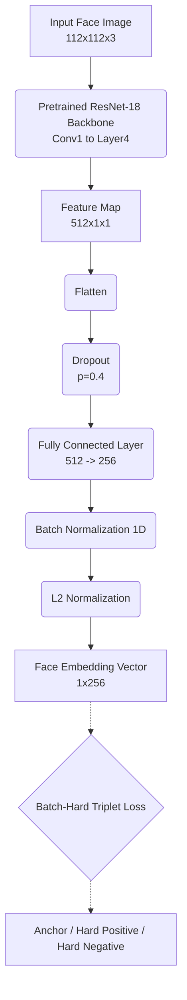

# Facial Similarity Detection Report

## 1. Introduction

### Background of the Selected Topic

- **Why this problem needs solving?** Face similarity detection (facial recognition and verification) is a foundational technology for secure authentication, identity verification, deduplication of records, and forensic analysis.
- **What is the importance of this topic?** As digital security transitions toward biometric access, having reliable, fast, and robust face verification models is critical. It impacts consumer electronics (phone unlocking), financial services (e-KYC), and large-scale media organization.
- **What is the state-of-the-art?** The current state-of-the-art relies on deep Convolutional Neural Networks (like ResNet or MobileNet architectures) trained on massive datasets using angular margin penalty losses (such as ArcFace, CosFace, or SphereFace). These methods are often supplemented with Triplet Loss fine-tuning to explicitly optimize the distance between specific hard pairs.

### Objectives of Your Work

1. **Develop a robust face similarity model** leveraging transfer learning by utilizing a pretrained ResNet-18 backbone.
2. **Train the model using Triplet Loss** with a Batch-Hard mining strategy to explicitly map faces into a highly discriminative L2-normalized embedding space.
3. **Implement heavy data augmentation** to improve model generalization and robustness against variations in lighting, quality, and demographic shifts.
4. **Evaluate the model thoroughly** using standard biometric performance metrics: False Acceptance Rate (FAR), False Rejection Rate (FRR), and Equal Error Rate (EER).

---

## 2. Proposed Method

### Model Details

#### Architecture Diagram

- **Backbone**: We utilize an ImageNet-pretrained **ResNet-18**. Instead of training a custom CNN from scratch, we remove the original classification head and extract the 512-dimensional feature maps. Pretraining provides strong low-level facial feature extraction (edges, textures) out of the box, which dramatically improves convergence and performance on smaller datasets.
- **Embedding Head**: A fully connected layer projects the 512-dimensional ResNet features down to a lower-dimensional embedding space (e.g., 256 dimensions), followed by Dropout and Batch Normalization.
- **L2 Normalization**: The final output is L2-normalized. This forces all face embeddings to reside on the surface of a hypersphere, making Cosine Similarity (or Cosine Distance) the optimal and natural metric for comparing two faces during inference.
- **Differential Learning Rates**: To prevent catastrophic forgetting of the useful ImageNet features, we apply a smaller learning rate to the pretrained backbone (e.g., 0.1x of the base learning rate) while the newly initialized embedding head learns at the full learning rate.

### Loss Function: Triplet Loss (Batch-Hard)

For this approach, we selected the **Triplet Loss** combined with a Batch-Hard mining strategy.

- **Concept**: The model processes an _Anchor_ image, a _Positive_ image (same identity), and a _Negative_ image (different identity). It attempts to minimize the distance between the Anchor and Positive, while maximizing the distance between the Anchor and Negative by a predefined `margin`.
- **Batch-Hard Mining**: Standard random triplets are often "too easy" and produce zero loss, slowing down training. To fix this, we construct batches containing multiple images per identity. For every anchor in the batch, the algorithm dynamically selects the _hardest positive_ (the furthest image of the same person) and the _hardest negative_ (the closest image of a different person) to form the triplet.
- **Formula**: $L = \max(0, d(a, p_{hardest}) - d(a, n_{hardest}) + margin)$
- **Why Triplet?** Triplet loss directly optimizes the relative distances between identities. By pushing away the closest impostors and pulling in the furthest genuine images, it continuously refines the local boundaries in the embedding space.

---

## 3. Dataset

- **Sources**: The pipeline is designed to pool identities from datasets like CASIA-WebFace (real faces) and DigiFace1M (synthetic faces).
- **Sampling and Splitting Strategy**:
  - The dataset is filtered to ensure a minimum number of images per subject.
  - To balance the dataset, we cap the maximum number of images per subject and can sample a specific subset of total subjects (e.g., 600 subjects).
  - The data is split into **80% Train, 10% Validation, and 10% Test by Identity**. It is crucial that identities in the Validation/Test sets are completely unseen during training to accurately measure generalizability.
- **Augmentation Pipeline**: To improve robustness and bridge domain gaps (e.g., evaluating on ethnicities underrepresented in the training data), we apply aggressive transformations during training:
  - Random Horizontal Flips.
  - Extensive **Color Jitter** (Brightness, Contrast, Saturation, Hue) to simulate varied lighting and skin tones.
  - **Gaussian Blur** to simulate out-of-focus or low-resolution inputs.
  - **Random Erasing** to simulate occlusions like masks, glasses, or hands covering the face.

---

## 4. Training Procedure

- **Optimizer**: We use the **AdamW** optimizer with weight decay to prevent overfitting.
- **Learning Rate Scheduler**: A **Cosine Annealing** learning rate scheduler is employed to smoothly decay the learning rate, allowing the model to make large updates early on and settle into a local minimum toward the end of training.
- **Batching Strategy (PKSampler)**: Triplet loss requires guaranteed same-identity pairs in every batch. We use a custom `PKSampler` that selects $P$ random identities and $K$ random images per identity (e.g., $P=16, K=4$ for a batch size of 64).
- **Gradient Clipping**: Because Batch-Hard Triplet loss can occasionally produce large gradient spikes when encountering extremely difficult pairs, we apply gradient clipping to stabilize training.
- **Checkpointing**: The model is evaluated periodically, and the best checkpoint is saved based on the lowest validation loss (or highest accuracy proxy).

---

## 5. Evaluation and Metrics

We evaluate the model in a realistic verification scenario by computing similarity thresholds over a massive set of genuine (same-person) and impostor (different-person) image pairs.

### Distance Metric

During inference, we compute the **Cosine Distance**: $1 - \text{Cosine Similarity}$.

- `0.0` indicates identical direction.
- `2.0` indicates exactly opposite directions.
- A threshold (e.g., 0.35) is calibrated; if the distance is below the threshold, the system predicts "Same Person".

### Evaluation Metrics

We extract embeddings for the validation/test set and generate all possible pairs, calculating the following standard biometric metrics across a sweep of 200+ threshold values:

1. **FAR (False Acceptance Rate)**: The fraction of impostor pairs incorrectly accepted as the same person. (Measures Security).
2. **FRR (False Rejection Rate)**: The fraction of genuine pairs incorrectly rejected as different people. (Measures User Convenience).
3. **EER (Equal Error Rate)**: The operating point (threshold) where FAR exactly equals FRR. A lower EER indicates a more discriminative and better-performing model.

The evaluation script outputs a table showing the FAR/FRR trade-offs at various operating thresholds, allowing stakeholders to choose a threshold that best balances security and convenience for their specific use case.

---

## 6. Results on Test Set

After training the model for 30 epochs and selecting the best checkpoint (Epoch 29), we evaluated the facial embeddings on the test set. 

**Summary of the Evaluation (500,000 Sampled Pairs):**
- **Genuine pairs:** 8,213
- **Impostor pairs:** 491,787
- **EER (Equal Error Rate):** 0.0925 @ threshold = 0.4150

**FAR / FRR Trade-offs at Key Operating Thresholds:**

| Threshold | FAR (False Accept Rate) | FRR (False Reject Rate) |
| --------- | ----------------------- | ----------------------- |
| 0.20      | 26.46%                  | 4.80%                   |
| 0.30      | 16.92%                  | 6.32%                   |
| 0.40      | 10.03%                  | 8.68%                   |
| 0.50      | 5.56%                   | 12.29%                  |
| 0.60      | 2.92%                   | 17.52%                  |
| 0.70      | 1.41%                   | 24.10%                  |

The model exhibits a competitive Equal Error Rate of ~9.25%. Depending on the required security level, the operating threshold can be adjusted (e.g., higher threshold for higher user convenience, lower threshold for tighter security).
